# MICROSERVICES DESIGN — CAB SYSTEM

## FR Mapping · Workflow · Ubiquitous Language · Subdomain · Microservice API · ERD · Database Type

**Dự án:** CAB System — Nền tảng đặt xe (23665061_TruongThanhTu_Cabsystem)
**Phạm vi tài liệu:** Thiết kế chi tiết 12 Bounded Context (Identity & Access, Customer Profile, Driver Profile & Fleet, Booking, Dispatch, Trip Execution, Pricing & Fare, Payment, Notification, Rating & Feedback, Operations & Back-office, Reporting & Analytics) đã xác định ở bước phân tích DDD, ánh xạ sang Microservice thực tế: FR/Workflow, Ubiquitous Language, Subdomain, API, ERD và loại Database.

---

## 1. Bounded Context ↔ Functional Requirement ↔ Business Process Workflow

SRS định nghĩa quy trình nghiệp vụ chính gồm 7 bước (mục "Business Process"):
`Bước 1: Tạo yêu cầu → Bước 2: Tìm tài xế → Bước 3: TX nhận/từ chối → Bước 4: Thực hiện chuyến → Bước 5: Tính cước → Bước 6: Thanh toán → Bước 7: Đánh giá`

| Bounded Context | FR liên quan | Bước Workflow phục vụ | Vai trò trong workflow |
|---|---|---|---|
| Identity & Access | FR01.1.1, FR01.1.2, FR01.2.1, FR01.2.2 | Pre-condition của Bước 1 | Xác thực trước khi KH/TX được phép thao tác |
| Customer Profile | FR01.1.3, FR01.1.4 | Trước Bước 1 (hồ sơ) · Sau Bước 7 (tra cứu) | Cung cấp thông tin KH, lưu lịch sử sau khi hoàn tất |
| Driver Profile & Fleet | FR01.2.3 – FR01.2.7 | Điều kiện đầu vào của Bước 2 | Cung cấp danh sách tài xế sẵn sàng + vị trí cho Dispatch |
| Booking (Ride Request) | FR02.1, FR02.2 | **Bước 1** | Tiếp nhận yêu cầu, theo dõi trạng thái tìm xe |
| Dispatch (Matching & Assignment) | FR03.1, FR03.2, FR03.3 | **Bước 2 + Bước 3** | Tìm, gửi offer, xử lý accept/reject/timeout, tìm thay thế |
| Trip Execution | FR04.1, FR04.2 | **Bước 4** | Cập nhật mốc trạng thái, theo dõi hành trình thời gian thực |
| Pricing & Fare | FR05.1 | **Bước 5** | Tính cước ngay khi Trip Execution phát `TripCompleted` |
| Payment | FR05.2, FR05.3 | **Bước 6** | Xử lý thanh toán, xử lý thất bại/thử lại |
| Rating & Feedback | FR09.1 | **Bước 7** | Nhận đánh giá sau khi chuyến hoàn tất |
| Notification | FR06.1, FR06.2, FR06.3 | Xuyên suốt Bước 1→7 (cross-cutting) | Lắng nghe event từ mọi bước, gửi thông báo tương ứng |
| Operations & Back-office | FR07.1, FR07.2, FR07.3 | Giám sát song song toàn bộ workflow | Can thiệp/xử lý sự cố tại bất kỳ bước nào qua Open Host API |
| Reporting & Analytics | FR08.1, FR08.2 | Sau toàn bộ workflow (aggregate) | Tổng hợp số liệu từ mọi bước phục vụ ra quyết định |

**Nhận xét:** Notification, Operations và Reporting là 3 context **cross-cutting** — không gắn với 1 bước cụ thể mà quan sát/phản ứng với toàn bộ workflow qua domain event, đúng tinh thần "lỗi ở đây không được chặn luồng chính" (BR14).

---

## 2. Ubiquitous Language — Từ điển thuật ngữ theo từng Bounded Context

| Bounded Context | Thuật ngữ cốt lõi (không dùng lẫn giữa các BC) |
|---|---|
| Identity & Access | `Account`, `Principal`, `Role`, `OtpChallenge` |
| Customer Profile | `Customer` (hồ sơ, không phải actor hành vi), `Trip History Entry` (bản ghi read-only) |
| Driver Profile & Fleet | `Driver` (hồ sơ đầy đủ), `Availability`, `Vehicle`, `Location Ping`, `Reputation Snapshot` |
| Booking (Ride Request) | `BookingRequest`, `PickupPoint`/`DropoffPoint`, `Cancellation` |
| Dispatch (Matching & Assignment) | `Candidate` (snapshot tạm thời, **≠** Driver đầy đủ), `Offer`, `Assignment`, `ExhaustionState` |
| Trip Execution | `Trip` (chỉ tồn tại sau khi có Assignment), `StatusTransition`, `TrackSnapshot` |
| Pricing & Fare | `Fare`, `Invoice` |
| Payment | `PaymentTransaction`, `Settlement`, `PSP` |
| Notification | `NotificationOutbox`, `Channel` |
| Rating & Feedback | `Rating`, `DriverReputation` |
| Operations & Back-office | `Staff`, `IncidentResolution`, `AuditEntry` |
| Reporting & Analytics | `Metric` (read model, không phải nguồn sự thật) |

> Quy tắc bắt buộc: khi code, **không** import trực tiếp entity `Driver` (Fleet Context) vào Dispatch Context — Dispatch chỉ dùng `Candidate` (DTO riêng của chính nó), dù dữ liệu gốc lấy từ Driver. Đây là ranh giới ngôn ngữ thực sự, không chỉ là quy ước đặt tên.

---

## 3. Phân loại Subdomain (Core / Supporting / Generic)

| Subdomain Type | Bounded Context | Lý do | Chiến lược đầu tư |
|---|---|---|---|
| **Core Domain** | Dispatch (Matching & Assignment) | Thuật toán tìm & phân công tài xế thời gian thực là giá trị cạnh tranh cốt lõi, phức tạp nghiệp vụ cao nhất (BR01–BR05) | Tự xây dựng, đầu tư kỹ sư giỏi nhất, thiết kế kỹ ngay từ đầu |
| **Core Domain** | Trip Execution | Quản lý vòng đời chuyến đi thời gian thực, trực tiếp ảnh hưởng trải nghiệm KH/TX | Tự xây dựng, ưu tiên cao |
| **Supporting Subdomain** | Booking (Ride Request) | Cần thiết riêng cho nghiệp vụ CAB nhưng logic không phức tạp bằng Dispatch | Tự xây dựng, mức đầu tư vừa phải |
| **Supporting Subdomain** | Pricing & Fare | Công thức tính cước đặc thù doanh nghiệp, nhưng không phải lợi thế cạnh tranh | Tự xây dựng, đơn giản, dễ thay đổi (BR15) |
| **Supporting Subdomain** | Driver Profile & Fleet | Quản lý hồ sơ, cần thiết nhưng là CRUD-nặng | Tự xây dựng, đầu tư trung bình |
| **Supporting Subdomain** | Customer Profile | Tương tự Fleet — CRUD-nặng | Tự xây dựng, đầu tư thấp–trung bình |
| **Supporting Subdomain** | Rating & Feedback | Hỗ trợ chất lượng dịch vụ nhưng logic đơn giản | Tự xây dựng, đầu tư thấp |
| **Supporting Subdomain** | Operations & Back-office | Đặc thù quy trình vận hành nội bộ doanh nghiệp | Tự xây dựng, đầu tư trung bình |
| **Supporting Subdomain** | Reporting & Analytics | Phục vụ ra quyết định, không phải sản phẩm bán cho khách | Tự xây dựng hoặc dùng BI tool có sẵn (Metabase/Superset) |
| **Generic Subdomain** | Identity & Access | Bài toán xác thực đã có giải pháp chuẩn (Keycloak, Auth0, Firebase Auth) | Cân nhắc dùng giải pháp có sẵn thay vì tự xây |
| **Generic Subdomain** | Payment | SRS yêu cầu rõ "tích hợp nhà cung cấp thanh toán bên ngoài" — bản thân việc xử lý thẻ không nên tự xây | Tích hợp PSP có sẵn (VNPay, Momo, Stripe...), chỉ tự xây phần orchestration nội bộ |
| **Generic Subdomain** | Notification | SRS yêu cầu "nhà cung cấp dịch vụ thông báo" — gửi SMS/Push đã có giải pháp chuẩn | Tích hợp dịch vụ có sẵn (Twilio, Firebase Cloud Messaging, Zalo ZNS) |

**Kết luận đầu tư:** Với 7 tuần triển khai, nên dồn lực kỹ thuật vào **Dispatch** và **Trip Execution** (Core), dùng SDK/dịch vụ có sẵn cho **Identity, Payment, Notification** (Generic) để tiết kiệm thời gian, còn lại (Supporting) làm CRUD đơn giản.

---

## 4. Microservice → API Endpoint (thiết kế lại theo ranh giới BC)

> So với 10 file API gốc: tách `/customers/trips/*` và `/drivers/trips/current` thành lời gọi liên service (không tự chứa logic); bổ sung **Dispatch Service** hiện đang thiếu hoàn toàn trong bộ API gốc; tách **Pricing** ra khỏi Payment.

| Microservice | Endpoint | Method | Ghi chú |
|---|---|---|---|
| **identity-service** | `/auth/register/customer`, `/auth/register/driver`, `/auth/login`, `/auth/verify-otp`, `/auth/refresh-token`, `/auth/logout` | POST | Giữ nguyên từ 01-auth-api.yaml |
| **customer-service** | `/customers/profile` (GET/PUT), `/customers/trips/history` (GET, gọi sang trip-service), `/customers/trips/{tripId}` (GET, gọi sang trip-service) | GET/PUT | Không tự lưu dữ liệu chuyến đi |
| **driver-service** | `/drivers/profile` (GET/PUT), `/drivers/status` (PATCH), `/drivers/location` (PATCH), `/drivers/trips/current` (GET, gọi trip-service) | GET/PUT/PATCH | + API nội bộ `GET /internal/drivers/candidates?lat&lng&radius&vehicleType` phục vụ Dispatch |
| **booking-service** | `/bookings` (POST), `/bookings/{tripId}/cancel` (POST), `/bookings/{id}/status` (GET — **mới**) | POST/GET | Publish `BookingCreated`/`BookingCancelled` |
| **dispatch-service** *(mới, hiện chưa có API)* | `/internal/dispatch/{bookingId}` (GET trạng thái), `/dispatch/offers/{offerId}/accept` (POST), `/dispatch/offers/{offerId}/reject` (POST) | GET/POST | Subscribe `BookingCreated`; Publish `DriverAssigned`/`NoDriverFound` |
| **trip-service** | `/trips/{tripId}/status` (PATCH), `/trips/{tripId}/track` (GET), `/internal/trips/{tripId}` (GET — phục vụ customer/driver-service) | PATCH/GET | Subscribe `DriverAssigned`; Publish `TripCompleted` |
| **pricing-service** *(mới, tách khỏi payment)* | `/internal/pricing/{tripId}/invoice` (GET) | GET | Subscribe `TripCompleted`; Publish `FareCalculated` |
| **payment-service** | `/payments/{tripId}/info` (GET), `/payments/{tripId}/process` (POST), `/payments/history` (GET) | GET/POST | ACL với PSP; Publish `PaymentSucceeded`/`PaymentFailed` |
| **notification-service** | `/notifications` (GET), `/notifications/{id}/read` (PATCH), `/notifications/read-all` (PATCH) | GET/PATCH | Không có API "gửi" công khai — chỉ subscribe event nội bộ |
| **rating-service** | `/ratings/{tripId}` (POST), `/ratings/driver/{driverId}` (GET) | POST/GET | Subscribe `TripCompleted`; Publish `DriverRated` |
| **operations-service (BFF)** | `/admin/customers`, `/admin/drivers`, `/admin/trips`, `/admin/trips/{tripId}/resolve`, `/admin/audit-logs` | GET/POST/PUT/DELETE | Orchestrator — gọi Open Host API của các service khác, không có DB nghiệp vụ riêng ngoài `audit_log` |
| **reporting-service** | `/reports/dashboard`, `/reports/revenue`, `/reports/driver-performance`, `/reports/trips` | GET | CQRS read-only, DB riêng biệt hoàn toàn |

---

## 5. ERD theo từng Bounded Context (Database per Service)

Mỗi microservice sở hữu **schema/DB riêng** — không JOIN chéo giữa các service ở tầng DB, chỉ liên kết qua `id` tham chiếu (không có FK vật lý xuyên service).

### 5.1 Identity & Access
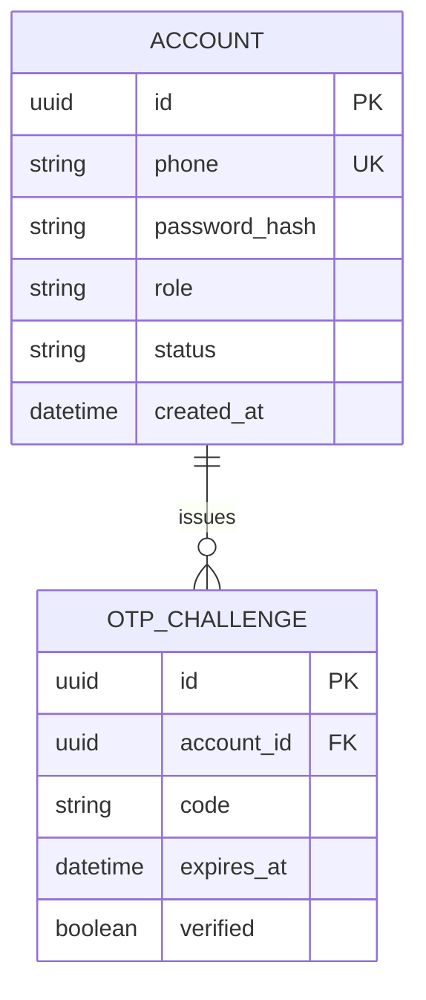

### 5.2 Customer Profile
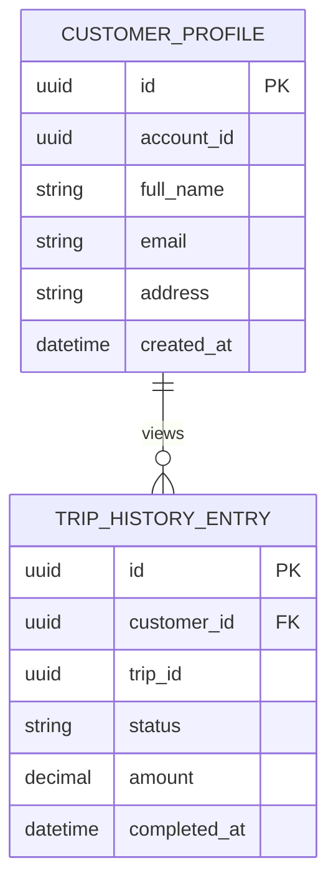
*`TRIP_HISTORY_ENTRY` là bảng chiếu (materialized read-model), đồng bộ qua event, không phải nguồn sự thật.*

### 5.3 Driver Profile & Fleet
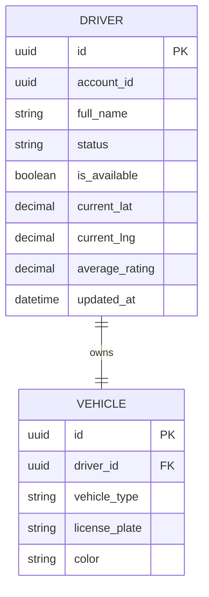

### 5.4 Booking (Ride Request)
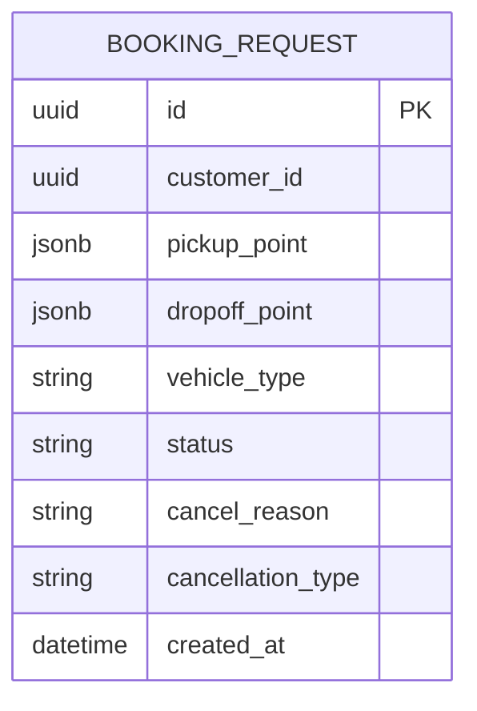

### 5.5 Dispatch (Matching & Assignment)
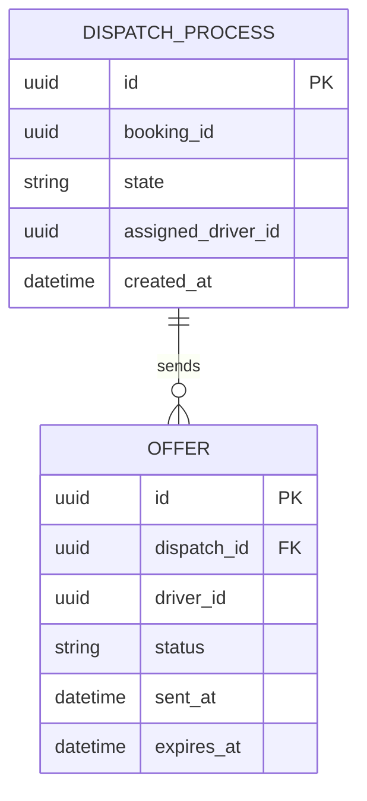

### 5.6 Trip Execution
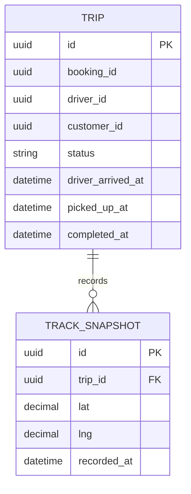

### 5.7 Pricing & Fare
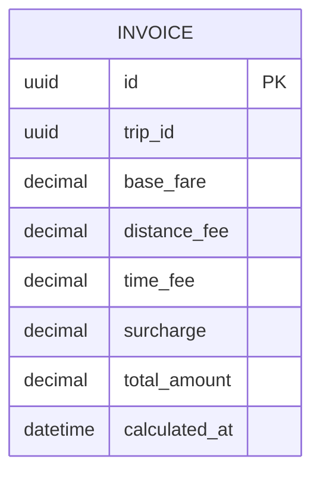

### 5.8 Payment
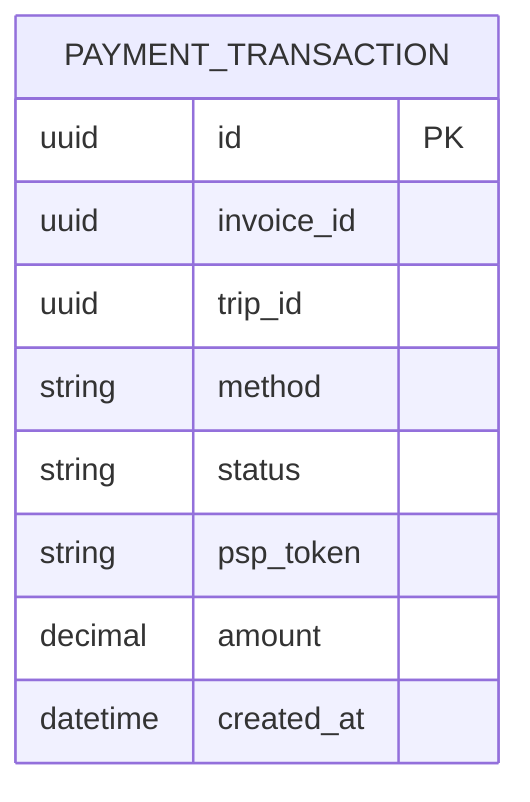
*Không có cột lưu số thẻ/CVV — tuân thủ BR09.*

### 5.9 Notification
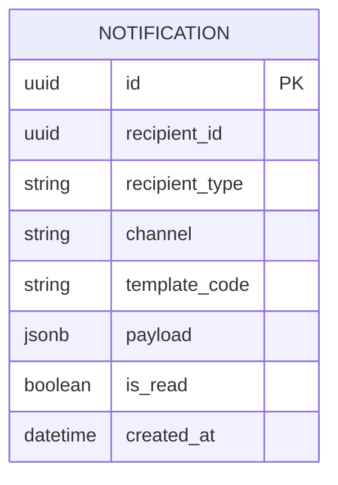

### 5.10 Rating & Feedback
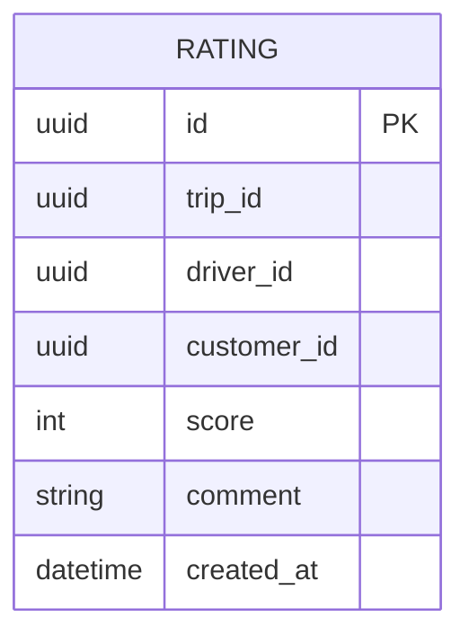

### 5.11 Operations & Back-office
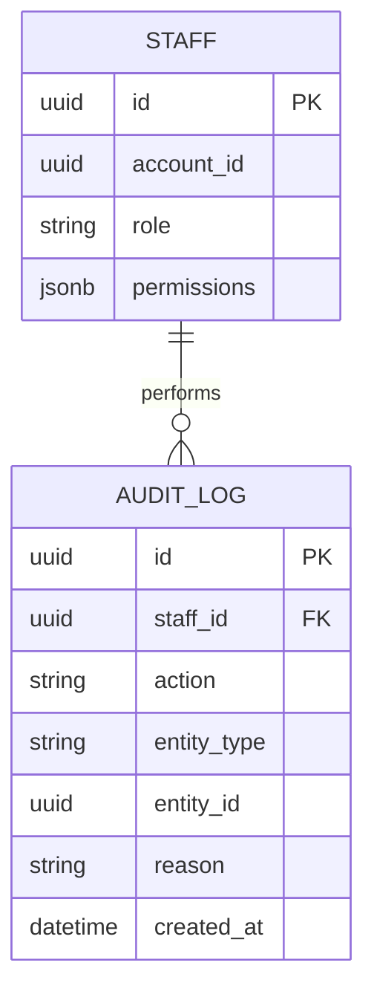

### 5.12 Reporting & Analytics (Star Schema, không phải ERD quan hệ thông thường)
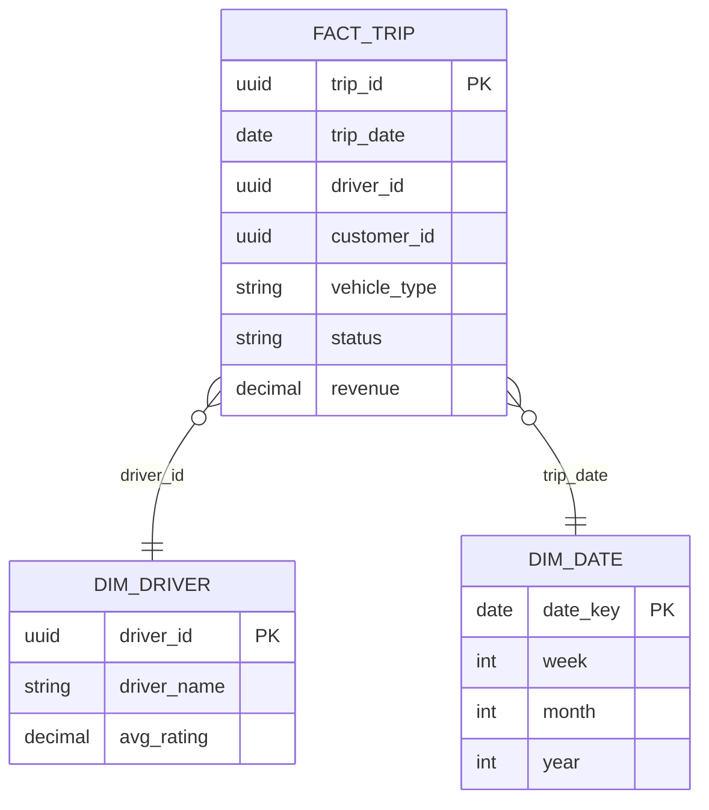

---

## 6. Loại cơ sở dữ liệu đề xuất theo từng Bounded Context

| Bounded Context | Loại Database đề xuất | Lý do |
|---|---|---|
| Identity & Access | RDBMS (PostgreSQL) | Cần ACID mạnh, schema ổn định, ít thay đổi |
| Customer Profile | RDBMS (PostgreSQL/MySQL) | Dữ liệu quan hệ đơn giản, cần toàn vẹn |
| Driver Profile & Fleet | RDBMS + **Geospatial index** (PostGIS) hoặc **Redis Geo** cho vị trí thời gian thực | Cần truy vấn "tài xế gần đây" hiệu năng cao — RDBMS thường cho hồ sơ, Redis Geo cho vị trí live |
| Booking (Ride Request) | RDBMS | Giao dịch cần nhất quán (ACID) khi tạo/hủy yêu cầu |
| Dispatch (Matching & Assignment) | **In-memory / Redis** (state ngắn hạn, cần TTL cho Offer, tốc độ đọc/ghi cực cao) + RDBMS lưu lịch sử assignment sau khi hoàn tất | Trạng thái matching sống rất ngắn (giây), không cần bền vững lâu dài ở tầng nóng |
| Trip Execution | RDBMS cho `Trip`; **Time-series DB** (InfluxDB) hoặc Redis Stream cho `TrackSnapshot` nếu tần suất cập nhật vị trí cao | Tách dữ liệu trạng thái (ít, quan trọng) khỏi dữ liệu vị trí tần suất cao (nhiều, ít quan trọng từng điểm) |
| Pricing & Fare | RDBMS | Dữ liệu tài chính cần nhất quán, đơn giản về cấu trúc |
| Payment | RDBMS (PostgreSQL) với transaction mạnh | Giao dịch tài chính bắt buộc ACID, audit đầy đủ |
| Notification | **NoSQL Document DB** (MongoDB) hoặc Message Queue (Kafka/RabbitMQ) làm nguồn chính | Dữ liệu bán cấu trúc, throughput cao, không cần join phức tạp |
| Rating & Feedback | RDBMS | Cấu trúc đơn giản, cần join với trip/driver ở mức vừa phải |
| Operations & Back-office | RDBMS cho `Staff`; **Append-only / NoSQL** (hoặc Elasticsearch) cho `AuditLog` để hỗ trợ tìm kiếm log nhanh | Audit log cần bất biến (immutable) và tìm kiếm full-text tốt |
| Reporting & Analytics | **Data Warehouse / OLAP** (ClickHouse, BigQuery, Redshift, hoặc PostgreSQL + materialized view nếu quy mô nhỏ) | Tối ưu truy vấn tổng hợp lớn, tách hoàn toàn khỏi OLTP để không ảnh hưởng hiệu năng nghiệp vụ chính |

**Nguyên tắc chung:** *Database per Service* — nếu triển khai theo hướng Modular Monolith giai đoạn 1 (đề xuất ở tài liệu trước), có thể dùng **chung 1 instance PostgreSQL nhưng tách schema riêng theo từng BC** (VD: `identity.accounts`, `booking.booking_requests`, `dispatch.offers`...) để giữ ranh giới logic, sẵn sàng tách thành DB vật lý riêng khi chuyển sang microservice thật sự.
